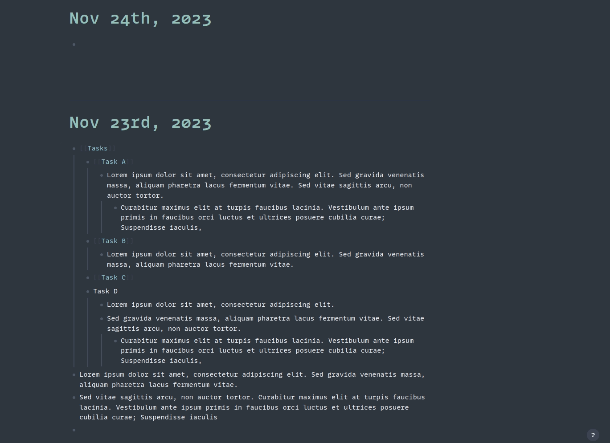

# Logseq block shallow copy

The Block Shallow Copy plugin empowers users with a seamless copying experience, allowing them to duplicate a selected block along with all its child blocks, limited to a depth of one level. This feature proves invaluable when you need to replicate a specific section of content, preserving its hierarchical structure effortlessly.

## Key Features:
- Effortless Duplication: Duplicate a chosen block and its immediate child blocks effortlessly with a single action.
- Preservation of Hierarchy: Maintain the hierarchical arrangement of content by copying not just the selected block but also its first-level children.
- Journal Integration: Seamlessly copy blocks directly to the current journal page, streamlining the workflow and ensuring the new content is readily available in the desired location.
- Intuitive User Interface: The plugin is designed with user-friendliness in mind, making the copying process intuitive and accessible for users of all skill levels.
- Custom Storage Options: Choose where the copied blocks are stored - whether in today's journal page for immediate access or in the clipboard for later use, providing flexibility to adapt to your specific workflow.
- __(TODO)__ Flexible Depth Control: While maintaining simplicity, the plugin offers control by limiting the copy to a one-level depth, striking a balance between comprehensive duplication and avoiding unnecessary complexity.

## How to Use:
1. Select Block: Highlight the target block you want to copy by right clicking at the block.
2. Activate Plugin: Execute the Block Shallow Copy plugin by clicking "Shallow copy", triggering the duplication process.
3. Paste in Journal: The duplicated content, along with its first-level children, will be seamlessly copied to the current journal page.

## Benefits:
- Time-Efficient Workflow: Speed up your content creation process by duplicating structured blocks in a single click.
- Maintain Consistency: Ensure uniformity across your content by replicating specific sections without the hassle of manual recreation.
- Enhanced Organization: Easily organize and reorganize your content on the current journal page without sacrificing the original structure.

